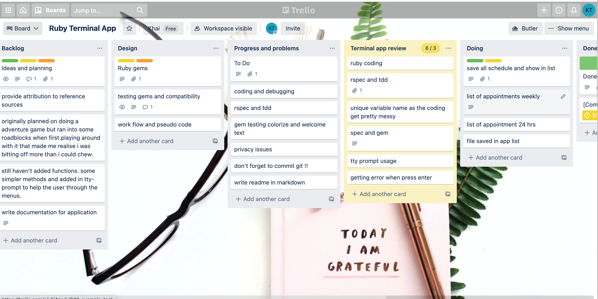
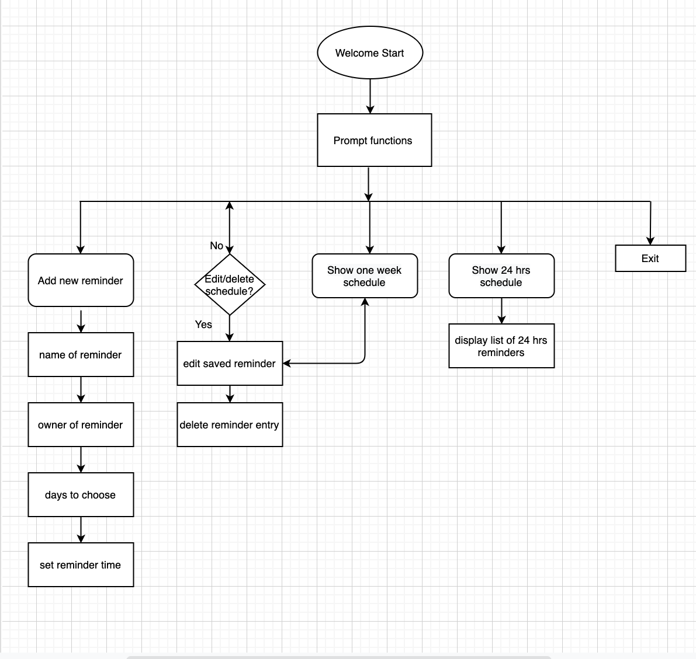

# Personal reminder CLI app

# Purpose and planning 

The purpose of this terminal app is to assist to remind the regular schedules weekly plan they need to go appointment or activities to join. As a person with busy schedules this app is help to remind their appointments or add , edit and delete functions so it cannot be missed.

The idea came up for myself as a mum of school age kid I need the weekly plan and reminder is for coming week activities and stuff need to prepare.

This app is designed for people who are forgetful but would prefer to use simple command line interface utility to help.

The future updates and extensions will be added during the code learning journey for better application.

Project planning tools trello is very useful during prepartion of this project. By using it we can share the list of works to be done , the progress of the app , testing and error handling, back log problems to solve out.


[visit-my-trello](https://trello.com/b/yEwz2P8M/ruby-terminal-app)

# Work flow and development diagram app



## Functionality

Weekly reminder allow simply put your name and show the appointment schedules to do. The information is stored and can be edited, add/delete schedules. You can view the weekly and 24 hrs reminder of the schedule according to user request. This app help you prepare for what you to need to bring for next events or appointment so you cannot miss before you go out.

## Installation 
# Features, software development and error handling and Gems usage

### Ruby Version and gems

For the Reminder app to run you will need to have Ruby 2.7.2 installed.

https://www.ruby-lang.org/en/documentation/installation/

The list of gems are used for the app appearance and functions

source "https://rubygems.org"

git_source(:github) { |repo_name| "https://github.com/#{repo_name}" }

gem "tty-prompt"
gem "tod"
gem "colorize", "~> 0.8.1"
gem "rspec"

### How to run app and list of function used

To use the app  the following dependencies, which can be installed by running the  ```install-dependencies.sh``` shell script, or from the ```/src``` directory using ```bundle install```:

- tty-prompt (to display menu functionality)
- Tod (to display time of day classes)
- colorize (to enhance readability of terminal output)

### Starting Reminder app

You can launch Reminder by either running the included ```reminder-app.sh``` script or by running ```ruby reminder-app.rb``` from the ```/src``` directory.

### How to use menu

Menu navigation is performed using the up↑ and down↓ arrow keys and the spacebar or enter to select an option.

### Adding reminders

To add reminders, select "Add new reminders" from the main menu. There is submenu, which is taken on particular days of week to seletct. Then you can put time to set the reminder.

You can select which days the actvities want to set by using the up and down arrow keys to move the cursor and press Space to select or unselect a day. Press enter when you have selected all the days you need to take the reminders.

### Viewing reminder list, editing and deleting reminders entries

- To view, edit or delete reminders entries, select "View, edit or delete existing reminders" from the main menu. This presents a submenu.

- To view all entries and the accociated reminder list, select "View all reminders entries". You will be presented with a list of reminders entries for your reference.

- To edit the entry select "Edit a reminders entry". The list of reminders entries will be shown with number accordingly. Enter the number of the entry you wish to edit and press enter, or if you want to cancel type "q" and press enter.

- To delete the entry, select "Delete a reminders entry". The list of reminders entries will be shown with number accordingly. Enter the number of the entry you wish to delete and press enter, or if you want to cancel type "q" and press enter.

### Viewing a week and 24 hour schedules list

Reminder app show you a 1 week or 24 hour schedule. With the TTY-prompt gems features, user can able to choose multiple days selections for the reminder. This functions is useful for the upcoming events or activies for the week or 24 hrs prior so that you can prepare neccessary earlier.

- To view a 1 week schedule, select "Get 1 week schedule" from the main menu you can see the list of schedules for name of the person, reminder topic, day and time going for one week will be printed.

- In a 24 hour schedule, you can view the time schedule need to prepare in next 24 hrs for name of person to remind, about what appiontment will have and time period selected will be displayed.

### Exiting Reminder

By choosing "Exit" the Reminder will be exit from main menu and "Thank you" will be appreared.

### Usage of arguments

The follwing are Reminder supports command line arguments which is to navigate without using the main menu navigator.
```
--add       - add a new reminders
--edit      - show view/edit/delete reminders menu
--week      - print a 1 week schedule
--help      - show help and command line arguments
```

To view more detail about my reminder termial app please visit my git hub (https://github.com/khaingtt/T1A3)

## License

[MIT](https://choosealicense.com/licenses/mit/)